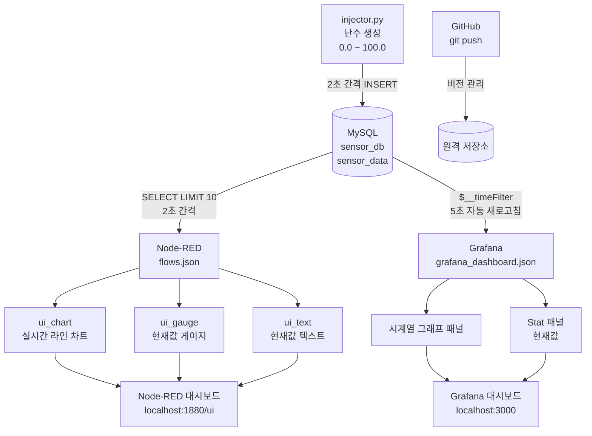

# 센서 데이터 실시간 모니터링 프로젝트

## 프로젝트 개요

Python으로 생성한 랜덤 센서 데이터를 MySQL에 저장하고,
Node-RED와 Grafana를 통해 실시간 대시보드로 시각화하는 IoT 모니터링 시스템입니다.

- **데이터 생성**: Python(injector.py) — 0~100 사이 랜덤값을 2초 간격으로 MySQL에 저장
- **시각화 1**: Node-RED Dashboard — 웹 브라우저 기반 실시간 차트/게이지
- **시각화 2**: Grafana — 시계열 그래프 및 현재값 Stat 패널

---

## 시스템 구성

| 구성 요소 | 역할 | 포트 |
|---|---|---|
| MySQL | 센서 데이터 영구 저장 | 3306 |
| Python injector | 랜덤 센서값 생성 및 DB INSERT | — |
| Node-RED | SQL 조회 + 웹 대시보드 | 1880 |
| Grafana | 시계열 분석 대시보드 | 3000 |

---

## 시스템 흐름도



---

## 파일 구성 및 역할

| 파일 | 역할 |
|---|---|
| `setup_db.sql` | MySQL DB/테이블/사용자 생성 SQL |
| `requirements.txt` | Python 패키지 목록 (`mysql-connector-python`) |
| `injector.py` | 랜덤 센서값 생성 및 MySQL INSERT 스크립트 |
| `flows.json` | Node-RED 플로우 (Inject → MySQL → 대시보드) |
| `grafana_dashboard.json` | Grafana 대시보드 JSON (Import 용) |
| `run.sh` | 전체 환경 자동 설정 및 실행 스크립트 |
| `.gitignore` | Git 추적 제외 파일 목록 |
| `project.md` | 프로젝트 설명 문서 |

---

## 설치 및 실행 방법

### 사전 요구사항

```bash
# MySQL 설치
sudo apt-get install -y mysql-server

# Node.js + Node-RED 설치
curl -fsSL https://deb.nodesource.com/setup_20.x | sudo -E bash -
sudo apt-get install -y nodejs
sudo npm install -g --unsafe-perm node-red

# Node-RED 플러그인 설치
cd ~/.node-red
npm install node-red-dashboard node-red-node-mysql

# Grafana 설치
sudo apt-get install -y software-properties-common
wget -q -O - https://packages.grafana.com/gpg.key | sudo apt-key add -
echo "deb https://packages.grafana.com/oss/deb stable main" | sudo tee /etc/apt/sources.list.d/grafana.list
sudo apt-get update && sudo apt-get install -y grafana
```

### 단계별 실행

#### 방법 A — 자동 실행 (권장)

```bash
cd ~/sensor_project
chmod +x run.sh
./run.sh
```

#### 방법 B — 수동 단계별 실행

**1단계: MySQL 초기화**

```bash
sudo systemctl start mysql
sudo mysql -u root < setup_db.sql
```

**2단계: Python 가상환경 설정**

```bash
cd ~/sensor_project
python3 -m venv .venv
source .venv/bin/activate
pip install -r requirements.txt
```

**3단계: Node-RED 실행**

```bash
cp flows.json ~/.node-red/flows.json
node-red &
```

**4단계: Grafana 시작**

```bash
sudo systemctl start grafana-server
```

**5단계: injector.py 실행**

```bash
source .venv/bin/activate
python3 injector.py
```

---

## Grafana 데이터소스 설정 (최초 1회)

1. `http://localhost:3000` 접속 (초기 계정: `admin` / `admin`)
2. **Connections → Data Sources → Add data source → MySQL** 선택
3. 아래 정보 입력:

| 항목 | 값 |
|---|---|
| Host | `localhost:3306` |
| Database | `sensor_db` |
| User | `sensor_user` |
| Password | (설정한 비밀번호 입력) |
| TLS/SSL Mode | `disable` |

4. **Save & Test** 클릭

## Grafana 대시보드 가져오기

1. **Dashboards → Import** 클릭
2. `grafana_dashboard.json` 파일 업로드
3. 데이터소스로 위에서 생성한 MySQL 선택 후 **Import**

---

## 접속 URL 안내

| 서비스 | URL | 설명 |
|---|---|---|
| Node-RED 에디터 | http://localhost:1880 | 플로우 편집기 |
| Node-RED 대시보드 | http://localhost:1880/ui | 실시간 차트/게이지 |
| Grafana | http://localhost:3000 | 시계열 대시보드 |

---

## GitHub 업로드

```bash
cd ~/sensor_project
git init
git add .
git commit -m "feat: 센서 실시간 모니터링 프로젝트 초기 설정"
git branch -M main
git remote add origin https://github.com/<your-username>/sensor_project.git
git push -u origin main
```

---

## 종료 방법

```bash
# injector.py: Ctrl+C

# Node-RED 종료
pkill -f node-red

# Grafana 종료
sudo systemctl stop grafana-server

# MySQL 종료
sudo systemctl stop mysql
```
