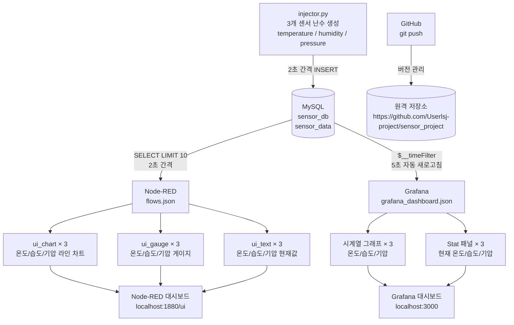

# 센서 데이터 실시간 모니터링 프로젝트

## 프로젝트 개요

Python으로 생성한 3개 센서(온도/습도/기압)의 랜덤 데이터를 MySQL에 저장하고,
Node-RED와 Grafana를 통해 실시간 대시보드로 시각화하는 IoT 모니터링 시스템입니다.

- **온도(temperature)**: 0.0 ~ 50.0 °C 범위의 난수, 소수점 2자리
- **습도(humidity)**: 0.0 ~ 100.0 % 범위의 난수, 소수점 2자리
- **기압(pressure)**: 900.0 ~ 1100.0 hPa 범위의 난수, 소수점 2자리
- **삽입 주기**: 2초마다 3개 값 동시 INSERT
- **시각화 1**: Node-RED Dashboard — 차트 / 게이지 / 텍스트
- **시각화 2**: Grafana — 시계열 그래프 / Stat 패널

---

## 시스템 구성

| 구성 요소 | 역할 | 포트 |
|---|---|---|
| MySQL | 센서 데이터 영구 저장 | 3306 |
| Python injector | 3개 센서 난수 생성 및 DB INSERT | — |
| Node-RED | SQL 조회 + 웹 대시보드 (차트/게이지/텍스트) | 1880 |
| Grafana | 시계열 분석 + Stat 대시보드 | 3000 |

---

## 시스템 흐름도



---

## 파일 구성 및 역할

| 파일 | 역할 |
|---|---|
| `setup_db.sql` | MySQL DB / 테이블 / 사용자 생성 SQL |
| `requirements.txt` | Python 패키지 목록 (`mysql-connector-python`) |
| `injector.py` | 3개 센서 난수 생성 및 MySQL INSERT 스크립트 |
| `flows.json` | Node-RED 플로우 (Inject → MySQL → 차트/게이지/텍스트) |
| `grafana_dashboard.json` | Grafana 대시보드 JSON (Import 용) |
| `run.sh` | 전체 환경 자동 설정 및 실행 스크립트 |

---

## 설치 및 실행 방법

### 사전 요구사항

```bash
# MySQL 설치
sudo apt-get install -y mysql-server

# Node.js + Node-RED 설치
curl -fsSL https://deb.nodesource.com/setup_20.x | sudo -E bash -
sudo apt-get install -y nodejs
sudo npm install -g --unsafe-perm node-red

# Node-RED 플러그인 설치
cd ~/.node-red
npm install node-red-dashboard node-red-node-mysql

# Grafana 설치
sudo apt-get install -y software-properties-common
wget -q -O - https://packages.grafana.com/gpg.key | sudo apt-key add -
echo "deb https://packages.grafana.com/oss/deb stable main" | sudo tee /etc/apt/sources.list.d/grafana.list
sudo apt-get update && sudo apt-get install -y grafana
```

### 단계별 실행

#### 1단계: MySQL 테이블 초기화

```bash
sudo mysql -u root -p < ~/sensor_project/setup_db.sql
```

#### 2단계: Python 가상환경 설정

```bash
cd ~/sensor_project
python3 -m venv .venv
source .venv/bin/activate
pip install -r requirements.txt
```

#### 3단계: Node-RED 플로우 적용 및 실행

```bash
cp ~/sensor_project/flows.json ~/.node-red/flows.json
pkill -f node-red
node-red &
```

#### 4단계: Grafana 시작

```bash
sudo systemctl start grafana-server
```

#### 5단계: injector.py 실행

```bash
cd ~/sensor_project
source .venv/bin/activate
python3 injector.py
```

---

## Grafana 데이터소스 설정 (최초 1회)

1. `http://localhost:3000` 접속 (초기 계정: `admin` / 초기 비밀번호 입력)
2. **Connections → Data Sources → Add data source → MySQL** 선택
3. 아래 정보 입력:

| 항목 | 값 |
|---|---|
| Host | `localhost:3306` |
| Database | `sensor_db` |
| User | `sensor_user` |
| Password | (설정한 비밀번호 입력) |
| TLS/SSL Mode | `disable` |

4. **Save & Test** 클릭 후 `Database Connection OK` 확인

---

## Grafana 대시보드 Import 방법

### 기존 대시보드 삭제 후 새로 Import

1. Grafana 접속 → **Dashboards** 메뉴 이동
2. 기존 `Sensor Realtime Dashboard` 우클릭 → **Delete** 선택
3. 상단 **New → Import** 클릭
4. `grafana_dashboard.json` 파일 업로드 또는 JSON 내용 붙여넣기
5. 데이터소스 항목에서 위에서 생성한 MySQL 데이터소스 선택
6. **Import** 클릭

---

## Node-RED 기존 Flow 삭제 후 새로 Import

### 방법 A — flows.json 직접 교체 (권장)

```bash
# Node-RED 종료
pkill -f node-red

# flows.json 교체
cp ~/sensor_project/flows.json ~/.node-red/flows.json

# Node-RED 재시작
node-red &
```

### 방법 B — Node-RED 에디터에서 Import

1. `http://localhost:1880` 접속
2. 우측 상단 햄버거 메뉴(≡) → **Import** 클릭
3. **select a file to import** 클릭 → `flows.json` 선택
4. 기존 플로우 탭 우클릭 → **Delete** 선택
5. 우측 상단 **Deploy** 클릭

---

## 접속 URL 안내

| 서비스 | URL | 설명 |
|---|---|---|
| Node-RED 에디터 | http://localhost:1880 | 플로우 편집기 |
| Node-RED 대시보드 | http://localhost:1880/ui | 실시간 차트/게이지/텍스트 |
| Grafana | http://localhost:3000 | 시계열 대시보드 |

---

## 종료 방법

```bash
# injector.py 종료
Ctrl+C

# Node-RED 종료
pkill -f node-red

# Grafana 종료
sudo systemctl stop grafana-server

# MySQL 종료
sudo systemctl stop mysql
```

---

## GitHub

- 저장소: https://github.com/Userlsj-project/sensor_project
